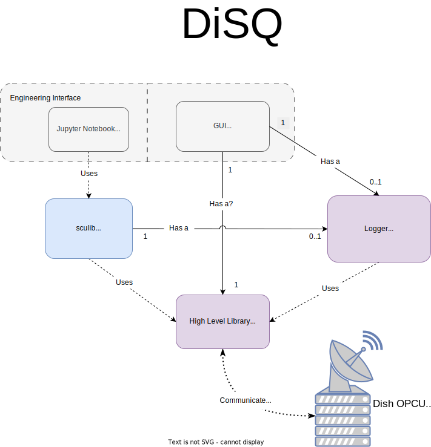

===========================================
SKA-Mid Dish Structure Qualification (DiSQ)
===========================================

This project is developing the Dish Structure Qualification software for the SKA-Mid telescope.

------------
Introduction
------------

DiSQ enables engineers and scientists to control and qualify observatory dish structures for the SKA-Mid telescope. The dish structures will be delivered with a PLC based control system which provides an OPC-UA interface for external control and monitoring. The DiSQ software communicates with the PLC via this interface and provides the users with:

- A GUI application for easy control and monitoring of key features.
- A Python API intended for performing complex operations such as tracking for verification of the dish structure, intended to be used in Jupyter notebooks.
- A data logger built in to both of the two above interfaces to allow recording of engineering parameters published from the PLC.

.. toctree::
   :maxdepth: 1
   :caption: Reference

   Dish Steering Control Unit (SCU)<api/sculib>
   Dish OPC UA Server Validator<api/server_validator>
   DiSQ Configuration<api/configuration>
   DiSQ Data Logger<api/logger>
   